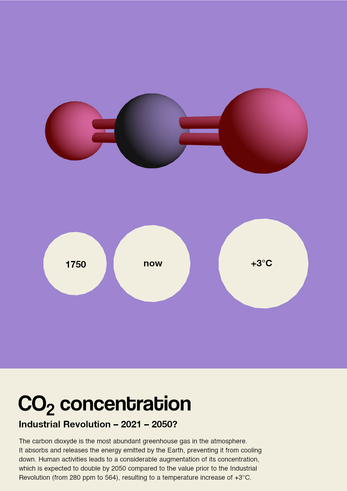

# Carbon dioxyde concentration visualization

## 1 - Overview

The main idea is to observe 3 data points of $CO_2$ concentration in atmosphere:  
- past
- now
- future

It happens that a carbon dioxyde molecule is composed of 3 atoms, $O=C=O$, and its 3D representation (sphere and cylinders bonds) is quite recognizable (although not perfectly exact, but still great to visualize). Disposing such a representation of a $CO_2$ molecule with perspective, one can see 3 spheres of growing sizes, quite like the 3 data points. Playing with the perspective and the camera orientation, one can expect to find a molecule aligned with the data values.  

As the human brain is better at comparing 2D shapes than 3D ones, a projection of the circular shapes of the atoms is displayed. Moreover, the molecule alone can be confusing because of the perspective: the eyes see indeed 3 different sizes but the brain tends to understand that they are supposed to be at the same size in a real world. Thus, the choice to put the molecule alongside with its 2D projection is made, and the user can easily make the connection. Also, the 2D disks can offer a better accuracy.  

## 2 - Data

The atmospheric $CO_2$ concentration is indicated in ppm (parts per million). It should not be confused with $CO_2e$ (equivalent $CO_2$), which takes in account all greenhouse gas (ghg). Of course, all ghg are responsible for the global warming, but $CO_2$ is the most abundant, and therefore the most known and impactful (although other ghg such as methane (CH4) are more impactful at equivalent proportion).  

All the calculations are available in [this notebook](https://github.com/NicolasDenier/CO2_concentration/blob/main/disk_sizes.ipynb)  

The past reference corresponds to before the Industrial Revolution (around 1750). A concentration of **280 ppm** is estimated, and often taken as reference ([source](https://en.wikipedia.org/wiki/Carbon_dioxide_in_Earth%27s_atmosphere)). For example, the GIEC Representative Concentration Pathway scenarios are predicting the radiative forcing (directly induced by the ghg concentration increase), from that reference.  

The "now" value comes from the Little Pictures [GitHub repository](https://github.com/littlepictures/datasets/blob/main/ghg/ghg_xco2_yearly_global.csv) which comes from the [ESA measurements](https://catalogue.ceda.ac.uk/uuid/070522ac6a5d4973a95c544beef714b4). The latest available data are for 2021, that year is thus selected. A concentration value is available for 156 countries. The final value is the average of all these, that is **413.3 ppm**.  

The "future" value is obtained from some calculations and answers to the following interrogation: how much $CO_2$ concentration leads to a +3°C temperature increase?  
The first formula gives the radiative forcing $\Delta F$ induced by a $CO_2$ concentration (C), compared to a reference ($C_0$): $\Delta F = 5.35 ln(C/C_0)$  
(this approximation can be found [here](https://fr.wikipedia.org/wiki/Forçage_radiatif)).  
The second formula can be used to estimate the temperature difference linked to a given radiative forcing: $\Delta T = 0.8 \Delta F$   
This is supposed a bit more representative than the Stefan Boltzmann formula ([source](https://www.science-climat-energie.be/2018/04/10/forcage-radiatif-sensibilite-climatique-et-retroactions-positives/)).  
From these, it can be found that doubling the $CO_2$ concentration gives a +2.96°C temperature increase. An exact +3°C is obtained with a **564.4 ppm** value, that is the third data point. The worst predictive scenarios tells that this value can be reached as soon as 2050.  

Now that 3 values are selected, represented by disk areas, another calculation is required to get the radius of these disks. The well known $A=\pi r^2$ is used. Then the ratios between two radius are computed, so that the data can be represented at any scale.  

## 3 - Composition

The 3D shapes are made using p5.js, a JavaScript framework made for visualizations (the script is referenced [here](https://github.com/NicolasDenier/CO2_concentration/blob/main/CO2_molecule.js)). The $CO_2$ molecule is composed of three spheres (atoms) linked by two thin cylinders representing the covalent bonds. The carbon atom, at the center, is usually black and the surrounding oxygen atoms are red. The carbon is slightly bigger, but the van der Waals radius differs from the sources: 170 picometers (pm) for carbon and 152 for oxygen mostly. The french Wikipedia however refers to 150 and 140 pm respectively. This ratio is kept as it is very light and makes the representation better fits the data.  

On the same canvas as the molecule, the three disks are drawn in a parallel plane to the camera. The radius are respecting the ratios to represent the exact picked values. Then, the camera can be adjusted so that the perspective change the size of the spheres, until it match the disk sizes. Once the best angle is found, the disks are translated down for a better exposure.  

The resulting image is downloaded and modified with GIMP (an open source image manipulation software): the disks color is changed, the text annotations are added, and the whole is set in the same style as other little pictures.  
